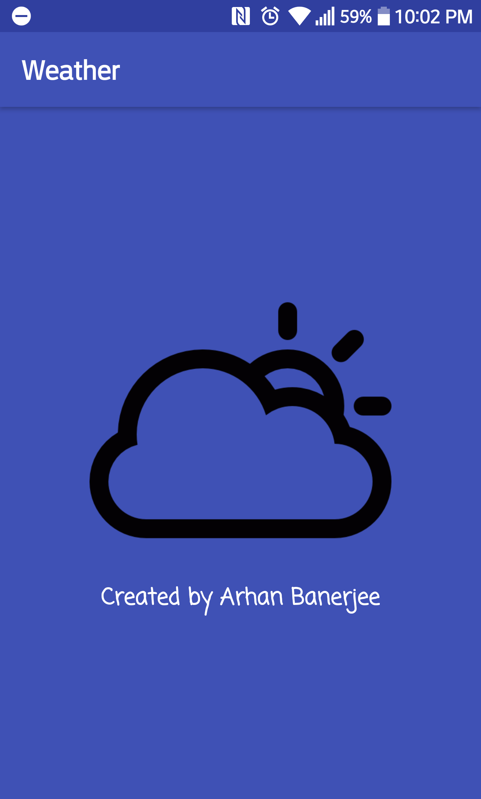
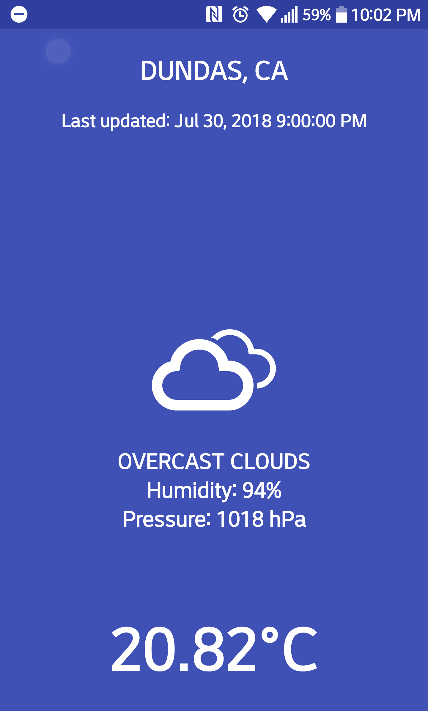

# Android Weather Application

## Introduction

This is a fully working application that can be installed on any Android device running Android KitKat(4.4) or higher

This app takes the user's location (with their permission) and sends the data to Openweather API which returns the current 
weather to the device. The device then takes this data and outputs the correct image and text (Up to 20 different scenarios) to the user.

### ------Known Issues-------

 - If location is not enabled or given permission to, the application will stay on the startup screen and will force quit after one minute to save system resources
 
 - Due to this being an open source API, the appliation will only refresh every two hours to get the current weather data from OpenWeather. As a result, I have added the time it was last refreshed on the top of the application

### Images

********
